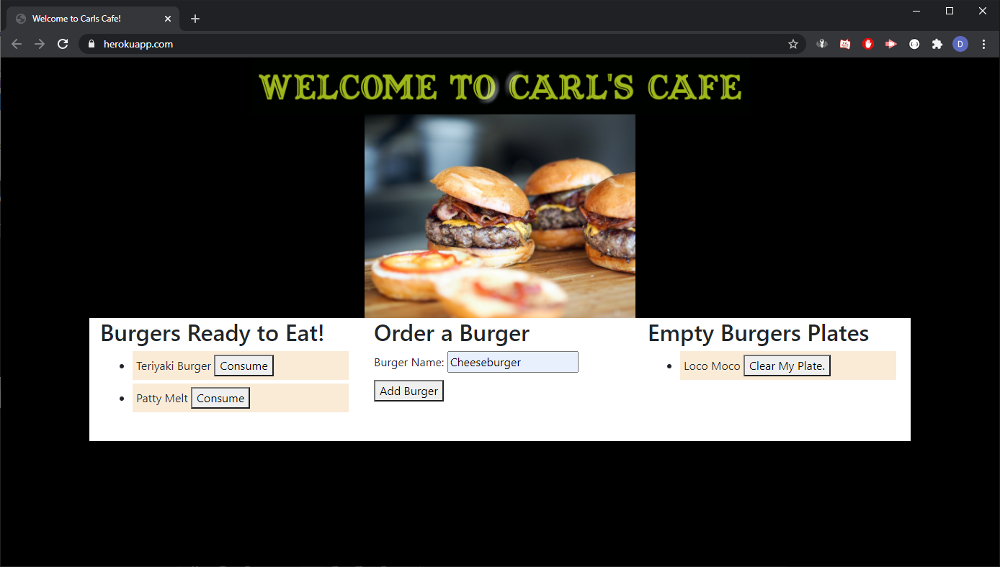
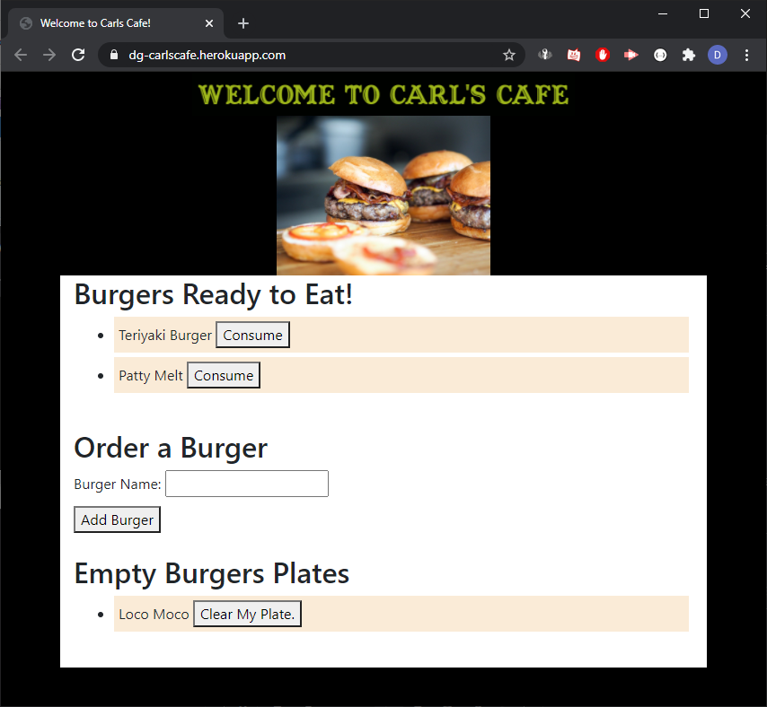

# Carls-cafe

### Author: David Guthmann

github: https://github.com/Dguthmann/Carls-cafe  
livesite: https://dg-carlscafe.herokuapp.com/  

## List of Contents

server.js  
package.json  
package-lock.json  
screenshot.png  
screenshot2.png  
README.md  
LICENSE
### config  
connection.js  
orm.js  
### controllers  
burgerController.js  
### db  
schema.sql  
seeds.sql  
### models  
burger.js  
### public
#### assets  
##### css  
style.css  
##### js  
burgers.js  
##### pics  
burger.jpg  
carlslogo.gif  
### views  
index.handlebars  
#### layouts  
main.handlebars  
#### partials
##### burgers
burger-block.handlebars  

## Installation
you will need the following additional npms to run this project:  
express  
express-handlebars  
mysql  
handlebars-helper-css (for further development)

## Basic Overview of Project

The goal of the project is to model a burger shop where users can make an order, eat the order, and have their dishes bussed.  

## Screenshot of Project

  

  

## Resources Used

Joe Rehfuss, Aslan Ghodsian, and Zachary Stowell for some debugging (route naming auditing).  
Zach Auerbach for some css and styling tips.  

## Further Development Plans

It would be neat to actually take this small project and have it work for ordering for a table or to have it be bussed in these times of social distancing; however, time frames are limited currently.

## Changelog

2020-10-16: Debug, final testing, readme, heroku deployment  
2020-10-15: Writing of most of the code and functionality
